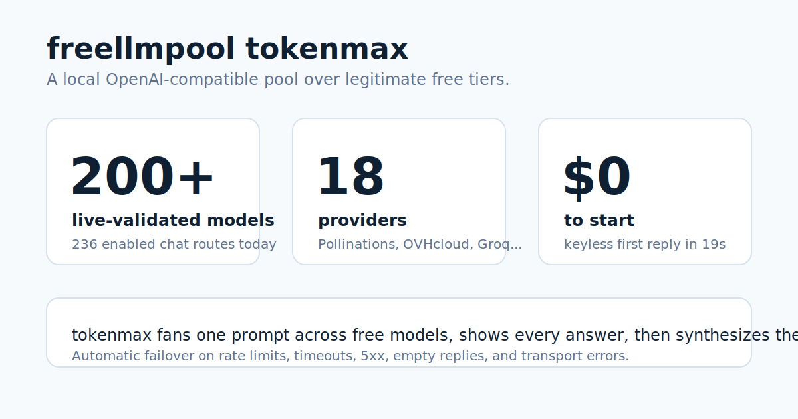

# freellmpool

> Traducción al español de [README.md](README.md). Puede quedar por detrás de la
> versión en inglés; si algo no coincide, toma el README en inglés como fuente de
> verdad.





Agrupa los niveles gratuitos de 18 proveedores de LLM (200+ modelos validados
en vivo, 300+ catalogados) detrás de un endpoint compatible con OpenAI: como
CLI, biblioteca de Python o proxy local. Funciona sin claves de API.

[](https://pypi.org/project/freellmpool/)
[](https://github.com/0xzr/freellmpool/actions/workflows/ci.yml)
[](LICENSE)
[](https://0xzr.github.io/freellmpool/)

[FAQ](FAQ.md): a dónde van los prompts, postura de ToS, failover, bloqueos y
comparaciones.

## Inicio rápido en 30 segundos

Una instalación nueva hasta la primera respuesta de un modelo gratuito toma unos
19 segundos en un entorno limpio Linux/Python 3.12, sin claves de API:

```bash
python3 -m venv .venv
. .venv/bin/activate
python -m pip install --upgrade pip
python -m pip install freellmpool
freellmpool ask --max-tokens 32 "Reply with one short sentence: freellmpool is ready."
```

CI ejecuta la misma ruta desde este checkout con
`FREELLMPOOL_QUICKSTART_PACKAGE=. scripts/quickstart-test.sh`.

Groq, Cerebras, NVIDIA NIM, Google Gemini, OpenRouter, GitHub Models,
Cloudflare, Mistral, Cohere y otros ofrecen niveles gratuitos, pero cada uno
tiene su SDK, límites de tasa y cupo diario. freellmpool los pone en una sola
bolsa: envía cada solicitud a un proveedor al que tienes acceso, cambia al
siguiente cuando hay rate limit o caída, y registra el uso diario para aprovechar
mejor cada nivel.

Varios proveedores (Pollinations, OVHcloud y Kilo Gateway) no necesitan clave de
API, así que el inicio rápido anterior responde de inmediato.

Agrega claves para los demás proveedores para desbloquear más modelos y límites
más altos.

## Ejecuta un agente de código con modelos gratuitos

El proxy de freellmpool habla tanto la API de OpenAI como la de Anthropic, así
que los agentes de código pueden usar niveles gratuitos agrupados sin cambiar
código: basta con apuntarlos al proxy.

```bash
freellmpool proxy                       # starts http://localhost:8080
freellmpool code claude                 # prints the one-line setup for Claude Code
# (also: codex, aider, cline, continue, cursor, opencode)
```

El modo gateway de Claude Code también puede lanzarse directamente:

```bash
ANTHROPIC_BASE_URL=http://localhost:8080 \
ANTHROPIC_AUTH_TOKEN=dummy \
ANTHROPIC_MODEL=auto \
ANTHROPIC_SMALL_FAST_MODEL=auto \
CLAUDE_CODE_ENABLE_GATEWAY_MODEL_DISCOVERY=1 \
claude
```

Tus aplicaciones OpenAI/Anthropic existentes funcionan igual: define
`OPENAI_BASE_URL` (o `ANTHROPIC_BASE_URL`) al proxy y conserva tu código.

**OpenCode** tiene una integración más profunda: un **dashboard** en vivo dentro
del editor (modo de enrutamiento, $ ahorrados, tokens servidos gratis, carrera
de proveedores, latencia), **enrutamiento por calidad** por solicitud desde el
selector de modelos (`freellmpool/auto|fast|quality|fair`) y herramientas
`freellmpool_status` / `freellmpool_models`. Consulta
[integrations/opencode-tui](integrations/opencode-tui) y la
[guía](https://0xzr.github.io/freellmpool/run-opencode-on-free-models.html).

**Nuevo en 0.11:** herramientas de capacidad. `freellmpool capacity status`
muestra qué niveles gratuitos son usables ahora, `freellmpool providers health`
los prueba en vivo, y `freellmpool keys add` te guía para configurar más (ver
[Capacidad y salud de proveedores](#capacidad-y-salud-de-proveedores) y
[docs/CAPACITY.md](docs/CAPACITY.md)).

**Nuevo en 0.10:** API asíncrona (`AsyncPool`), servidor MCP
(`freellmpool mcp`), enrutamiento consciente de latencia con
`freellmpool benchmark`, hooks de observabilidad y sistema de plugins para
proveedores personalizados. Consulta el [changelog](CHANGELOG.md).

## Instalación

```bash
pip install freellmpool      # or: pipx install freellmpool
```

La única dependencia es `httpx`. Python 3.11+.

## Línea de comandos

```bash
freellmpool ask "Write a haiku about sqlite"
git diff | freellmpool ask "Write a commit message for this"
freellmpool tokenmax "Hardest question you've got"  # 🌈 blast EVERY model, synthesize the swarm
freellmpool providers        # which providers are configured
freellmpool models           # every provider/model id
freellmpool stats            # lifetime tokens served free + avoided cost
freellmpool badge -o badge.svg   # a shareable SVG badge of that total
```

`freellmpool tokenmax` es el modo de máximo esfuerzo: envía tu prompt a **cada
modelo de cada proveedor**, imprime cada respuesta y sintetiza el mejor veredicto,
mientras muestra una animación arcoíris `TOKENMAXXING` en la terminal. También
existe como herramienta MCP `tokenmax`; consulta [docs/MCP.md](docs/MCP.md).

`freellmpool stats` es un total acumulado **persistente** de por vida (sobrevive
reinicios y actualizaciones). Inserta `freellmpool badge` en un README, o sírvelo
en vivo desde el proxy en `/badge.svg` (activa
`FREELLMPOOL_PUBLIC_BADGE=1` para hacerlo embebible públicamente).

Fija un proveedor o modelo; los nombres comunes de modelos OpenAI/Anthropic se
mapean a equivalentes gratuitos para que los scripts existentes sigan funcionando:

```bash
freellmpool ask -m groq/llama-3.3-70b-versatile "hi"
freellmpool ask -p cerebras,groq "hi"
freellmpool ask -m gpt-4o-mini "hi"      # routed to a free model
```

## Como proxy

Ejecuta un servidor local que habla la API de OpenAI y apunta cualquier
herramienta compatible con OpenAI hacia él:

```bash
freellmpool proxy
export OPENAI_BASE_URL=http://localhost:8080/v1
export OPENAI_API_KEY=unused
```

```python
from openai import OpenAI
client = OpenAI()
print(client.chat.completions.create(
    model="auto",
    messages=[{"role": "user", "content": "hi"}],
).choices[0].message.content)

# audio → text (Whisper), same client:
print(client.audio.transcriptions.create(
    model="auto", file=open("audio.mp3", "rb"),
).text)
```

O con `curl` (subida multipart):

```bash
curl -s http://localhost:8080/v1/audio/transcriptions \
  -F file=@audio.mp3 -F model=auto
```

El proxy también implementa la API Responses de OpenAI (para Codex CLI) y la API
Messages de Anthropic (para Claude Code), así que los agentes de código también
pueden correr sobre modelos gratuitos. `freellmpool code <agent>` imprime la
configuración exacta:

```bash
freellmpool code aider       # also: claude, codex, cline, continue, cursor, opencode
```

Endpoints: `/v1/chat/completions` (streaming de tokens, tool calling),
`/v1/embeddings`, `/v1/audio/transcriptions` (Whisper, multipart),
`/v1/responses`, `/v1/messages`, `/v1/models` y una página `/dashboard` con uso.
Los snippets para herramientas específicas están en
[docs/INTEGRATIONS.md](docs/INTEGRATIONS.md) y [docs/AGENTS.md](docs/AGENTS.md).

## Como biblioteca

```python
from freellmpool import Pool

pool = Pool.from_default_config()
reply = pool.ask("Summarize the plot of Hamlet in 20 words.")
print(reply.text, "—", reply.provider_id)

vectors = pool.embed(["first document", "second document"]).vectors

with open("audio.mp3", "rb") as f:
    text = pool.transcribe(f.read(), "audio.mp3").text   # Whisper, failover across providers
```

La API asíncrona es igual, con `await`:

```python
from freellmpool import AsyncPool

async with AsyncPool.from_default_config() as pool:
    reply = await pool.aask("Summarize the plot of Hamlet in 20 words.")
```

Pasa `on_event=...` a cualquiera de los pools para recibir eventos estructurados
de enrutamiento/cache (`attempt`/`success`/`error`/`cooldown`/`cache_hit`/
`cache_miss`/`exhausted`) para logs o tracing. Agrega tu propio endpoint con
`register_provider(...)`, o una nueva forma de solicitud con
`register_adapter(name, fn)`.

## Benchmark de tus proveedores

`freellmpool benchmark` mide una llamada por proveedor configurado e imprime
latencia y éxito, para ver cuáles de tus niveles gratuitos están más rápidos
ahora. El router aprende la misma señal de latencia/éxito del tráfico real; usa
`FREELLMPOOL_ROUTING=fast` para preferir el proveedor con menor latencia en vez
del least-used-first predeterminado.

```
$ freellmpool benchmark
  provider/model            status   latency  note
  cerebras/llama-3.3-70b    ok        180 ms  6 tok
  groq/llama-3.3-70b        ok        240 ms  6 tok
  ovh/Meta-Llama-3_3-70B    FAIL           -  HTTP 429
```

## Capacidad y salud de proveedores

Los niveles gratuitos cambian durante el día: las claves expiran, los proveedores
caen y los cupos diarios se llenan. Estos comandos te dicen qué es usable ahora
y qué configurar después:

```bash
freellmpool capacity status --target 5   # who's healthy / near quota / missing a key
freellmpool providers health             # send one tiny request to each, time it
freellmpool keys checklist --target 5    # which keys to add to reach N healthy providers
freellmpool keys add groq                # configure a key (and record metadata)
```

`capacity status` es local-first: lee tu catálogo, entorno y contadores diarios,
y etiqueta cada proveedor como `healthy`, `low_quota`, `exhausted`, `invalid_key`
o `missing`. También sincroniza un catálogo externo consultivo
([mnfst/awesome-free-llm-apis](https://github.com/mnfst/awesome-free-llm-apis))
para sugerir proveedores gratuitos que podrías agregar; es solo consultivo, tu
`providers.toml` sigue siendo la fuente de verdad para el enrutamiento.
`keys add <name>` incluso puede importar un proveedor sugerido de ese catálogo o
crear un stub compatible con OpenAI y autodetectar sus modelos. El `/dashboard`
del proxy muestra la misma capacidad de un vistazo. Referencia completa:
[docs/CAPACITY.md](docs/CAPACITY.md).

## Como servidor MCP

`freellmpool mcp` ejecuta un servidor Model Context Protocol sobre stdio, para
que Claude Desktop, Claude Code o Cursor puedan delegar subtareas a modelos
gratuitos. Consulta [docs/MCP.md](docs/MCP.md). Se incluye un
[`server.json`](server.json) para el [registro MCP](https://registry.modelcontextprotocol.io/).

## En el CLI `llm` de Simon Willison

Hay un plugin: `llm install llm-freellmpool` -> `llm -m freellmpool "..."` sin
clave de API. Fuente: [0xzr/llm-freellmpool](https://github.com/0xzr/llm-freellmpool).

## Claves de proveedores

freellmpool lee claves del entorno y usa las que estén definidas. Ninguna es
obligatoria. Los enlaces de alta paso a paso para cada proveedor (todos gratis,
sin tarjeta) están en [docs/ACCOUNTS.md](docs/ACCOUNTS.md).

| Proveedor | Variable de entorno | Notas |
|---|---|---|
| Pollinations | — | no necesita clave |
| OVHcloud | — | no necesita clave (nivel anónimo) |
| LLM7 | `LLM7_API_KEY` | opcional |
| Groq | `GROQ_API_KEY` | rápido |
| Cerebras | `CEREBRAS_API_KEY` | rápido, cupo diario grande |
| NVIDIA NIM | `NVIDIA_API_KEY` | |
| OpenRouter | `OPENROUTER_API_KEY` | modelos gratuitos |
| Google Gemini | `GEMINI_API_KEY` | |
| GitHub Models | `GITHUB_TOKEN` | cualquier PAT |
| Cloudflare | `CLOUDFLARE_API_TOKEN` + `CLOUDFLARE_ACCOUNT_ID` | |
| Mistral, Cohere, SambaNova, Z.ai, Ollama Cloud, LongCat | ver `.env.example` | |

Un `config.toml` (ver [config.toml.example](config.toml.example)) puede guardar
claves, alias de modelos y ajustes en vez de variables de entorno.

## Diagnóstico local y operaciones

Ejecuta `freellmpool doctor` para una revisión local sin red de la versión del
paquete, rutas de configuración, conteo de proveedores configurados, modo de
enrutamiento, ubicaciones de quota/cache, antigüedad del cache del catálogo
externo y validez del catálogo incluido.

El cache de respuestas está apagado salvo que `FREELLMPOOL_CACHE_TTL` (segundos)
o `[settings] cache_ttl` sea positivo. Cuando se activa, las filas viven en
SQLite con modo WAL y poda por TTL; `FREELLMPOOL_CACHE_MAX_ENTRIES` limita filas
retenidas (predeterminado `10000`, usa `0` para desactivar poda por tamaño).

Los contadores de cuota se escriben de inmediato por defecto. Procesos largos de
proxy/MCP pueden reducir escrituras con `FREELLMPOOL_QUOTA_FLUSH_EVERY=N`, que
agrupa hasta `N` solicitudes exitosas antes de volcar. Las rutas de apagado y
`quota.snapshot()` vuelcan los conteos pendientes, así que dashboards y salidas
de proceso ven totales actuales.

## Cómo funciona el enrutamiento

Para cada solicitud, freellmpool construye la lista de pares `(provider, model)`
a los que tienes acceso, ordena proveedores por menor uso y elige un modelo con
menor uso dentro de ese proveedor. Así los proveedores con catálogos grandes,
como NVIDIA, no reciben más tráfico solo por exponer más modelos. Un proveedor
que devuelve 429 se aparta durante una ventana de cooldown. Los conteos diarios
se guardan en `~/.config/freellmpool/quota.json` y se reinician a medianoche UTC.

Cada llamada registra latencia y éxito por objetivo de modelo. Un proveedor cuyos
objetivos fallan se hunde al final automáticamente; con `FREELLMPOOL_ROUTING=fast`
el proveedor medido más rápido va primero. `freellmpool benchmark` calienta estas
métricas bajo demanda. Para restaurar el comportamiento antiguo de balanceo por
modelo, usa `FREELLMPOOL_ROUTING=legacy` o `FREELLMPOOL_ROUTING=model` (o
`FREELLMPOOL_ROUTING=model-fast` para el antiguo fastest-first por modelo).

**Enrutamiento por calidad (`FREELLMPOOL_ROUTING=quality`).** Los modelos más
fuertes de los niveles gratuitos tienen los cupos diarios más pequeños, así que
una bolsa ingenua se debilita durante el día. El enrutamiento por calidad asigna
la *dificultad* de cada prompt a la *capacidad* de cada modelo: prompts difíciles
(entrada larga, código, señales de razonamiento) van al modelo disponible más
fuerte, y los fáciles a modelos ligeros. Así se raciona la cuota escasa de
modelos fuertes y la bolsa se mantiene útil por más tiempo. La capacidad se basa
en benchmarks reales, no en nombres; si un modelo no aparece en ningún benchmark,
se usa una heurística por nombre.

Las puntuaciones offline incluidas vienen del Elo de [LMArena](https://lmarena.ai/)
(snapshot con licencia MIT) y del leaderboard de edición de código de
[Aider](https://aider.chat/) (Apache-2.0), normalizados a una escala percentil.
Para mucha más cobertura, ejecuta `freellmpool capability sync` con una clave
gratuita de [Artificial Analysis](https://artificialanalysis.ai/)
(`FREELLMPOOL_AA_API_KEY`); su Intelligence Index cubre la mayoría de modelos
actuales y open-weight y tiene prioridad. Los datos AA descargados se cachean
localmente bajo tu propia clave (nunca se empaquetan, por sus términos).
`freellmpool capability status` muestra la cobertura actual. Scores vía LMArena
y Aider; intelligence index vía Artificial Analysis cuando hay clave.

**Ventanas de contexto.** Los modelos gratuitos suelen tener ventanas de contexto
pequeñas. freellmpool nunca trunca tu entrada; cuando un modelo rechaza una
solicitud por ser demasiado larga, aprende el límite de ese modelo y deja de
enrutar allí entradas sobredimensionadas, escalando solo a modelos con ventanas
mayores. Si nada cabe, lanza un `ContextWindowExceeded` claro (con el tamaño de
entrada estimado) en vez de un fallo genérico; sobre el proxy eso es un `413`.
Puedes declarar la ventana de un modelo con `context = N` en `providers.toml`
para saltarlo de forma proactiva.

Notas de arquitectura: [docs/ARCHITECTURE.md](docs/ARCHITECTURE.md).

## Limitaciones

- Los modelos de niveles gratuitos son más pequeños que los modelos frontera.
  Sirven para borradores, resúmenes, clasificación, triage y código cotidiano,
  no como reemplazo de razonamiento GPT-class en problemas difíciles.
- La calidad y capacidad varían durante el día a medida que se agotan niveles
  con cupos altos; los límites se reinician a medianoche UTC.
- Los niveles gratuitos cambian sin aviso. Cuando un id de modelo o límite queda
  obsoleto, un PR de una línea a `providers.toml` lo corrige para todos.
- El proxy está pensado para uso local/de un solo usuario. Se enlaza a
  `127.0.0.1` por defecto; si lo expones, configura una clave (`--api-key`).
- La ruta Claude Code / Anthropic es experimental (texto y herramientas; sin
  visión).
- Estos son niveles gratuitos compartidos por todos; no abuses de ellos.

## Cómo se compara

| Herramienta | Inicio sin clave | # proveedores | Failover | Servidor MCP | CLI | Transcripción | Local/self-hosted | Licencia |
|---|---|---:|---|---|---|---|---|---|
| **freellmpool** | Sí: Pollinations, OVHcloud, Kilo Gateway; LLM7 permite clave opcional | 18 proveedores chat incorporados | Sí: prueba el siguiente proveedor ante rate limits, timeouts, 5xx, respuestas vacías y errores de transporte | Sí: `freellmpool mcp` | Sí: `freellmpool ask`, `tokenmax`, `providers`, `proxy` y más | Sí: `/v1/audio/transcriptions` compatible con OpenAI y failover de proveedor | Sí: paquete Python local y proxy local | MIT |
| OpenRouter free models | No: requiere cuenta/API key de OpenRouter | Una cuenta hospedada de OpenRouter que enruta a muchos upstreams; el router de modelos gratuitos lista variantes free | Sí: OpenRouter maneja routing/fallbacks | No es servidor MCP nativo; sus docs muestran patrones para clientes/herramientas MCP | Sin CLI local first-party en las docs revisadas | Sí: OpenRouter documenta APIs de transcripción de audio | No: servicio hospedado | Servicio propietario |
| LiteLLM | No: trae claves de proveedores o credenciales de LiteLLM hospedado | 100+ proveedores LLM | Sí: router/fallbacks, incluidos fallbacks de transcripción | Sí: LiteLLM Proxy incluye MCP Gateway | Sí: SDK/proxy, no un CLI one-shot de modelos gratuitos | Sí: soporte `/audio/transcriptions` | Sí: self-host del proxy o LiteLLM hospedado | MIT para el core; licencia comercial para piezas enterprise |
| FreeLLMAPI | No: agrega tus claves de proveedores gratuitos; proveedores keyless pueden configurarse después | 16 proveedores free-tier más endpoints OpenAI-compatible personalizados | Sí: cadena de fallback ante 429, 5xx y timeouts | Sin servidor MCP nativo en el README revisado | Dashboard/servidor, app desktop y Docker; sin CLI one-shot first-class en el README revisado | No: `/v1/audio/*` figura como no soportado aún | Sí: proxy Node/Docker self-hosted | MIT |

FreeLLMAPI existe antes que este proyecto, y el solapamiento es convergencia
independiente: ambos proyectos notaron que los niveles gratuitos legítimos son
útiles cuando se tratan con cuidado. El nicho de freellmpool es el **cliente
keyless e instalable con pip** para exprimir niveles gratuitos hospedados desde
CLI, biblioteca, proxy local y servidor MCP; OpenRouter es la ruta hospedada y
pulida; LiteLLM es el gateway maduro para traer tus propias claves.

Fuentes de la tabla: catálogo y código de proxy de freellmpool en este repo;
docs de quickstart, modelos gratuitos, routing y audio de OpenRouter; README,
docs MCP y docs de transcripción de LiteLLM; README de FreeLLMAPI.

## Preguntas frecuentes

**¿Hay un gateway LLM API gratis y compatible con OpenAI?** Sí. freellmpool es
un gateway gratuito con licencia MIT que expone un endpoint compatible con
OpenAI respaldado por los niveles gratuitos de 18 proveedores. `pip install
freellmpool` y apunta cualquier cliente OpenAI al proxy local.

**¿Cómo uso varias APIs LLM gratuitas a la vez?** freellmpool las agrupa: cada
solicitud va a un proveedor al que tienes acceso, falla al siguiente cuando uno
está rate-limited o caído, y registra uso diario para repartir carga entre
niveles.

**¿Puedo ejecutar Claude Code o Codex con modelos gratuitos?** Sí. El proxy habla
las APIs de OpenAI y Anthropic. Define `OPENAI_BASE_URL` o `ANTHROPIC_BASE_URL`
al proxy y ejecuta Codex, Claude Code, aider, Cline, Continue o Cursor sin
cambios. Para Claude Code, define `CLAUDE_CODE_ENABLE_GATEWAY_MODEL_DISCOVERY=1`
para que `/v1/models` se descubra a través del puente Anthropic. Consulta
`freellmpool code <agent>`. (La ruta Claude Code es experimental: texto +
herramientas, sin visión.)

**¿Necesito una clave de API?** No. Pollinations, OVHcloud y Kilo Gateway
funcionan sin clave, así que una instalación nueva responde de inmediato. Agrega
claves gratuitas de otros proveedores para más modelos y límites mayores.

**¿Es gratis y open source?** Sí, licencia MIT. Más en la
[página del proyecto](https://0xzr.github.io/freellmpool/).

## Destacado en

- Videos de la comunidad (por lytohlg AI): ["Accede a 18 modelos de IA GRATIS con 1 solo comando"](https://www.youtube.com/watch?v=1UfIlWoedho) y ["Prueba 18 IAs GRATIS sin API key en 30 segundos"](https://www.youtube.com/watch?v=oaM_E92WVGQ).
- Directorio: [FreeLLM Pool en MCP Market](https://mcpmarket.com/server/freellm-pool).

## Contribuir

Nuevos proveedores y correcciones a límites obsoletos son las contribuciones más
útiles, y normalmente son un cambio pequeño en `providers.toml`. Consulta
[CONTRIBUTING.md](CONTRIBUTING.md). Las tareas para nuevos contribuidores,
listas para mantenedores, están en
[docs/GOOD_FIRST_ISSUES.md](docs/GOOD_FIRST_ISSUES.md). Las pruebas corren sin
acceso de red:

```bash
python -m pip install -e ".[dev]" && ruff check . && pytest
```

## Licencia

MIT
